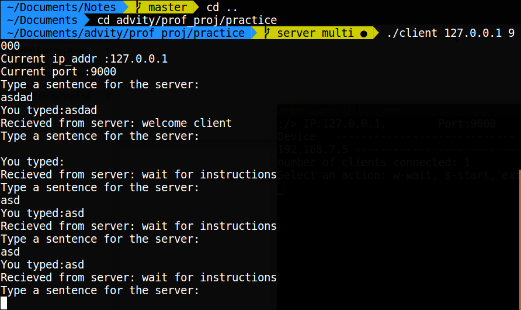
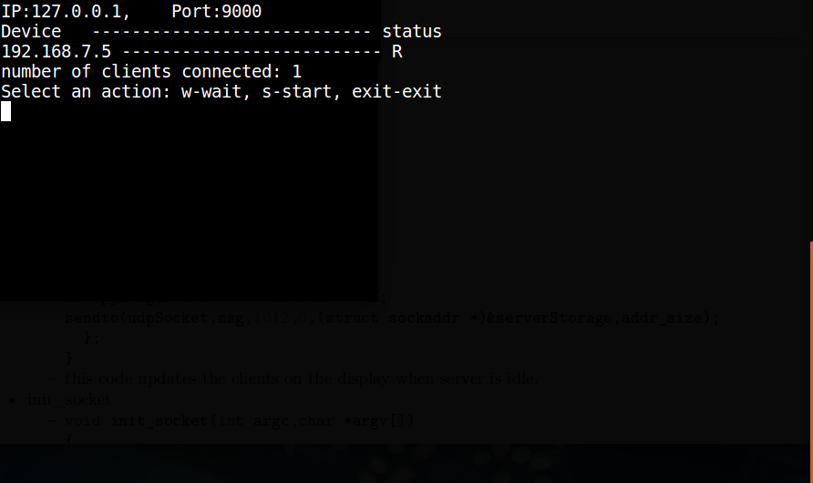

<title>README</title>

# Parallel Computation.


### Aim:
- The goal is to implement a mpi system between many beagel bone boards so that the processing of a task can be distributed among them.

### Contents:

1. UDP socket programming
2. Basic Layout 
3. Custom defined headers
4. Client 
5. Server

---

## 1. UDP socket programming.


**Socket:** It is an end point in a communication where the data is generated or recieved and is processed.


- UDP socket:
	We use the function _socket()_.
	syntax:
	int socket(int domain, int type, int protocol);
	-
```C
#include <sys/types.h>
#include <sys/socket.h>
int udpsocket = socket(AF_INET,SOCK_DGRAM,0);
```
	- the function return the file descriptor on successfully creating a socket, else it return -1 with errno set appropriatley.


- sockaddr:
	- it is evedent that the sockets communicate using the ip addresses. These details are stored in a structure known as SOCKADDR.
	- 
``` C
struct sockaddr {  
    unsigned short sa_family;  
    char sa_data[14];  
};  
```	
	- In order to make the contents of this structure more easy to access another structure is used, i.e SOCKADDR_IN.
	-
``` C
struct sockaddr_in{  
    short sin_family;  
    unsigned short sin_port;  
struct in_addr sin_addr;  
    char sin_zero[8];  
};  
```
	- Here :
		- sin_family: type of communication (AF_INET - for ipv4 protocol) .
		- sin_port: IP port.
		- sin_addr: IP address.
		- sin_zero: Just padding to make it equal to the structure SOCKADDR.
	- This sums up the c data structure that stores the parameters of the socket.

- bind:
	- Once the socket is created and the socaddr has been provided with the suitable values it is then binded together using the _bind()_ function.
	- 
```C
bind(udpSocket,(struct sockaddr *)&serverAddr, sizeof(serverAddr));
```
	- Here the serverAddr is typecast into sockaddr from sockaddr_in.
	- this registers the socket with the specified address so the communication to that socket can be made using the assigned address.

- Communication:
	- Once both server and client are setup and running, the communication happens using the functions, **sendto()** and **recvfrom()**.
	-
```C
ssize_t sendto(int sockfd, const void *buf, size_t len, int flags,const struct sockaddr *dest_addr, socklen_t addrlen);
ssize_t recvfrom(int sockfd, void *buf, size_t len, int flags,struct sockaddr *src_addr, socklen_t *addrlen);
```
	- sockfd is the file descriptor of the socket being used.


---


## 2.Basic layout


- server	_(functions and structures defined in server)_
	- client
	- display
	- server_input
	- server_routine
	- client_update
	- init_socket
	- check_input

- client
	- ```c
struct client
{
  char ip[12];
  char status;    // R - Ready
                  // N - Not Ready
                  // D - Disconnected
}clients[8];
```
	- this structure was made to keep track of the clients connected to the server, _clients[8]_ is the array that stores them. 


- display
	- ```c
void  display(char *argv[])
{
  system("clear");
  printf("IP:%s,\t Port:%s\n", argv[1],argv[2]);
  printf("Device   ---------------------------- status\n");
  int j;
  for(j=0;j<nclients;j++)
  {
    printf("%s -------------------------- %c\n",clients[j].ip,clients[j].status );
  };
  printf("number of clients connected: %d\n",nclients );
  printf("Select an action: w-wait, s-start, exit-exit\n");
  printf(":/> ");
}
```
	- this function clears the screen first, then displays all the connected client's ip and status, also displays no. of connected clients and prints a prompt _(which will be used in server\_input)_.


- server_input
	- ``` c
void *server_input(void *argp)
{
  while(1)
  {
    char action;
    scanf("%c",&action);
    switch (action)
    {
      case 'w':
        server_active = false;
        break;
      case 's':
        server_active = true;
        break;
    }
  };
}
```
	- this function takes a character input to decide what to do next.
	- the function was defined as pointer so as to attach it to a thread that will be created dring the main routine.

- server_routine
	- ```c 
void server_routine()
{
  while(server_active)
	{
	init_str(buffer);
	init_str(msg);
	init_ip(ip);
	nBytes = recvfrom(udpSocket, buffer, 1024, 0, (struct sockaddr *)&serverStorage, &addr_size);
	 extract(buffer,msg,ip);
	 int i;
	 for(i=0;i<nBytes-1-strlen(ip);i++)
	 { 
	  msg[i] = toupper(msg[i]);
	 };
	 sendto(udpSocket, msg, nBytes-strlen(ip), 0, (struct sockaddr *)&serverStorage, addr_size);
	};
}
```
	- this routine is the main task of the server, apart from computation, it is this code block that needs to be used to transfer (broadcast) data to the clients.
	- * the code here just converts the data recieved into uppercase and resend it. This is not the final code block.
	- the advantage though changing this code block changes the whole purpose of the server without having to change anything. sort of an API.


- client_update
	- ```c
void client_update()
{
  extract(buffer,msg,ip);
    int j;
    bool new_client = true;
     for(j=0;j<nclients;j++)
      {
        if(strcmp(clients[j].ip ,ip)==0)
        {
          new_client = false;
        };
      };
      if(new_client)
      {
        strcpy(clients[nclients].ip,ip);
        clients[nclients].status = 'R';
        nclients++;
        init_str(msg);
        strcpy(msg,"welcome client");
        sendto(udpSocket,msg,1012,0,(struct sockaddr *)&serverStorage,addr_size);
      }
      else
      {
        init_str(msg);
        strcpy(msg,"wait for instructions");
        sendto(udpSocket,msg,1012,0,(struct sockaddr *)&serverStorage,addr_size);
      };
}
```
	- this code updates the clients on the display when server is idle.


- init_socket
	- ``` c
void init_socket(int argc,char *argv[])
{
  udpSocket = socket(AF_INET, SOCK_DGRAM, 0);
  serverAddr.sin_family = AF_INET;
  serverAddr.sin_port = htons(port);
  serverAddr.sin_addr.s_addr = inet_addr(argv[1]);
  memset(serverAddr.sin_zero,'\0', sizeof serverAddr.sin_zero);
  bind(udpSocket, (struct sockaddr *)&serverAddr, sizeof(serverAddr));
  addr_size = sizeof serverStorage;
  server_active = false;
}
```
	- this is a typical way to initialize a udp socket.

- check_input
	- ```c
void check_input(int argc, char *argv[])
{
  if (argc == 3)
  {
    printf("Current ip_addr :%s\n", argv[1]);
  }
  else
  {
    printf("Error: Specify ip_addr and port_number\n");
    printf("Correct way of entering arguments is, <file_name> <ip_addr> <port_number>\n " );
     exit(0);
  }
  port = strtol(argv[2],NULL,10);
  printf("Current port :%d\n",port);
}
``` 
	- this part takes care that the input given is valid or not, else displays the correct way to enter them.


---

## 3. Custom defined headers

*note: some funcitons that were found to be non-standard are from this header.

- Custom headers created
	- strmp.h

- strmp  (functions defined in strmp.h)
	- extract
	- init_str
	- init_ip
	- wrap


- extract
	- ```c
void extract(char fmsg[], char msg[1024], char ip[12])
{
	int j,len,len_ip;
	len = strlen(fmsg);
	len_ip = strlen(ip);
	for(j=0;j<len_ip;j++)
	{
		ip[j]=fmsg[j];
	}
	for(j=0;j<len-len_ip;j++)
	{
		msg[j]=fmsg[j+len_ip];
	}
}
```
	- this function loads the actual message and ip of the client in seperate arrays.
- init_str
	- ```c
void init_str(char s[])
{
	memset(s,'\0',strlen(s));
}
```
	- this method was to make initializing strings with zero more easy as it has to be done all the time.

- init_ip
	- ```c
void init_ip(char ip[])
{
	init_str(ip);
	strcpy(ip,"198.168.1.1");	// dummy ip address for reference.
}
```
	- this is just a convinent way to initialize the ip, which is used for reference during the server trying to send data to client.

- wrap
	- ```c
void wrap(char fmsg[], char ip[], char msg[])
{
	strcat(fmsg,ip);
	strcat(fmsg,msg);
}
```
	- this method attaches the message to the tail of the ip. which is then used by the server to know the origin of the message.


---


## some screenshots:




